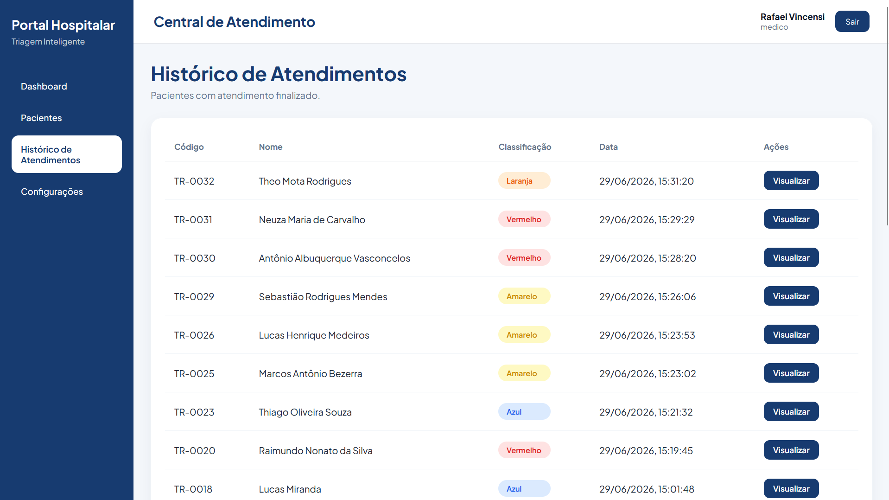

# 🏥 Intelligent Hospital Triage System

AI-powered hospital triage support system designed to assist healthcare professionals in patient risk classification, queue management and patient flow organization.

The system uses Artificial Intelligence to analyze patient symptoms and suggest risk classifications based on the Manchester Triage System guidelines.

It provides a web platform for healthcare professionals and a Telegram chatbot that allows patients to perform remote pre-triage after account activation.

The final decision remains under the responsibility of healthcare professionals, who can review and modify the classification suggested by the AI.


---

# 📌 About the Project

In high-demand healthcare environments, correctly identifying patient priority levels is essential to ensure that critical cases receive appropriate attention.

The Intelligent Hospital Triage System was developed as a support tool for healthcare professionals responsible for patient triage.

The platform centralizes patient information, manages the hospital queue and uses Artificial Intelligence to analyze reported symptoms and suggest risk classifications.

---

# ⚙️ Features

## 🖥️ Web Application

### Dashboard

- Overview of current appointments and patient flow.
- Summary information about active patients.

### Patient Management

- Patient registration.
- Patient search.
- Patient filtering.
- Active patient visualization.
- Appointment status management:
  - Waiting
  - In treatment
  - Completed

### Patient Details

The system provides:

- Patient information.
- Age.
- Phone number.
- Telegram activation status.
- Risk classification.
- Reported symptoms.
- AI-generated classification explanation.
- Professional notes.

Healthcare professionals can manually modify patient classification and status when necessary.

---

# 🩺 Triage Process

The triage process can be performed through the web application or the Telegram chatbot.

Workflow:

1. Patient reports symptoms.
2. Information is sent to the backend API.
3. The AI pipeline analyzes the provided data.
4. A risk classification is suggested.
5. The patient is automatically added to the waiting queue.

Risk classifications:

- 🔴 Red — Emergency
- 🟠 Orange — Very Urgent
- 🟡 Yellow — Urgent
- 🟢 Green — Less Urgent
- 🔵 Blue — Non Urgent

---

# 🤖 Telegram Chatbot

The chatbot allows patients to perform remote pre-triage.

To activate the chatbot, the patient must complete an initial registration process and receive an activation token linked to their account.

After activation, patients can:

- Request new triage assessments.
- Report symptoms through Telegram.
- Receive AI-generated risk classification.
- Check appointment information.
- Ask health-related questions.

All chatbot-based triages are automatically sent to the web system.

---

# 🧠 Artificial Intelligence

The risk classification pipeline uses a Retrieval-Augmented Generation (RAG) architecture.

Workflow:

```
Patient symptoms
        |
        ↓
Semantic search
        |
        ↓
Context retrieval from ChromaDB
        |
        ↓
Mistral model execution via Ollama
        |
        ↓
Risk classification + explanation
        |
        ↓
System update
```

Technologies used:

- **Ollama** - Local execution of language models.
- **Mistral** - Large Language Model used for classification.
- **ChromaDB** - Vector database for semantic retrieval.
- **RAG** - Retrieval-Augmented Generation architecture.

---

# 📷 Screenshots

## Login


## Dashboard


## Patients


## New Triage


## History



## Patient Details


## Telegram Bot


---

# 🏗️ Architecture

```
                         Patient
                            |
             ------------------------------
             |                            |
      Web Application              Telegram Bot
             |                            |
             ----------- FastAPI ----------
                            |
             ------------------------------
             |                            |
        PostgreSQL                  AI Pipeline
                                        |
                         -------------------------
                         |                       |
                    ChromaDB                 Mistral
```

---

# 🛠️ Technologies

## Frontend

- React
- Vite
- JavaScript
- CSS

## Backend

- Python
- FastAPI
- SQLAlchemy
- Pydantic

## Database

- PostgreSQL

## Artificial Intelligence

- Ollama
- Mistral
- ChromaDB
- RAG

## Integrations

- Telegram Bot API

## Tools

- Git
- GitHub
- VS Code
- DBeaver

# 🚀 How to Run

## 1. Clone the repository

```bash
git clone https://github.com/rafael-vincensi/hospital-triage-system.git

cd hospital-triage-system
```

---

## 2. Backend

```bash
cd backend

pip install -r requirements.txt

uvicorn main:app --reload
```

API:

```
http://127.0.0.1:8000
```

Documentation:

```
http://127.0.0.1:8000/docs
```

---

## 3. Frontend

```bash
cd frontend

npm install

npm run dev
```

Application:

```
http://localhost:5173
```

---

## 4. Artificial Intelligence

Install the model:

```bash
ollama pull mistral
```

Create the vector database:

```bash
cd ai

python knowledge_base.py
```

---

## 5. Telegram Bot

Configure the bot token:

```env
BOT_TOKEN=YOUR_TOKEN
```

Run:

```bash
cd ai/telegram_bot

python bot.py
```

---

# 🔮 Future Improvements

- User authentication and permission management.
- Hospital analytics dashboard.
- Complete patient history tracking.
- Integration with additional communication channels.
- Improvements to AI models and clinical embeddings.
- Cloud deployment.

---

# 👨‍💻 Author

**Rafael Vincensi de Miranda**
